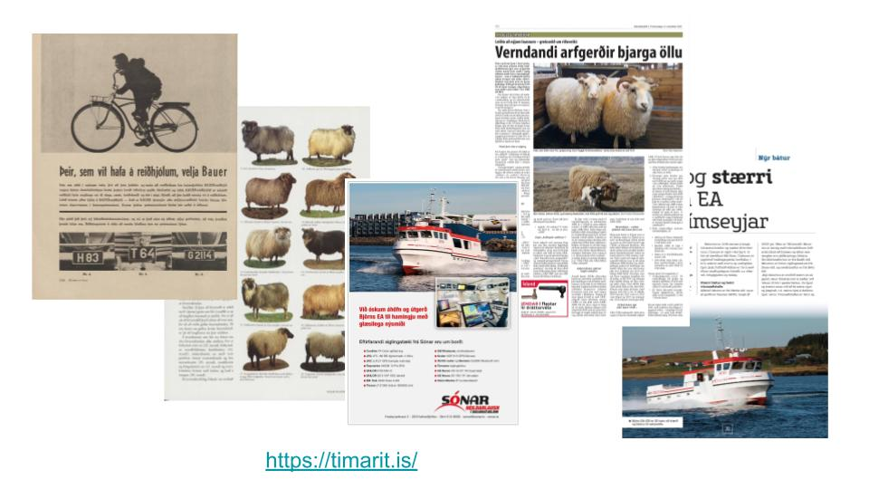

# workshop-notebooks-dhnb2024

This project has been developed as part of the workshop "Reusing digital collections from GLAM Labs: a Jupyter Notebook approach" for the [DHNB 2024 conference](https://www.conftool.org/dhnb2024/sessions.php).

The coordinators of the workshop are:

- Gustavo Candela, University of Alicante, Spain
- Mirjam Cuper, National Library of the Netherlands
- Olga Holownia, International Internet Preservation Consortium
- Max Pedersen, Royal Danish Library, Denmark

## Digital collections
[Timarit.is](https://timarit.is/) is a collaborative project between the following institutions:

- National Library of the Faroe Islands
- National and Public Library of Greenland
- National and University Library of Iceland

The access is open to everyone and the material is made available by using the latest methods in information technology.

## Notebooks

This project contains the following Jupyter Notebooks:

- [Getting-started-with-Yolo.ipynb](https://nbviewer.org/github/hibernator11/workshop-notebooks-dhnb2024/blob/main/notebooks/Getting-started-with-Yolo.ipynb) 
- [Yolo-detection-timarit.ipynb](https://nbviewer.org/github/hibernator11/workshop-notebooks-dhnb2024/blob/main/notebooks/Yolo-detection-timarit.ipynb) 

YOLO provides also a command line tool:

- [yolo-example-cli.ipynb](https://nbviewer.org/github/hibernator11/workshop-notebooks-dhnb2024/blob/main/notebooks/yolo-example-cli.ipynb) 
  

## Running the notebooks

**To execute the notebook in Binder:**

- Click the launch binder button above. Once the demo launches, click My_sample_notebook.ipynb in the file listing.
- Run the notebook by selecting Cell > Run All. You call also click the play button to run the notebook cell by cell. You will the output of each cell.
- You can edit the cells, and click on play to run and see the changes.

**To execute the notebook in Colab:**

- Click the Open in Colab button above. Select one notebook from the list provided.
- Make the notebook live by clicking 'Connect' in the Colab toolbar.
- You'll need to uncomment a few lines of code to make the notebook work. 
- Uncomment this cell by removing the three leading #. See the Section Steps required for Colab
- Select Runtime > Run All in the menu to execute the notebook. 
- You can also run cell by cell the notebook by clicking on the play button.

#### Steps required for Colab

This steps are required to be able to run the notebooks in Google Colab, including the installation of the python packages and the download of the images from GitHub (or using the GitHub url):

- `!pip install opencv-python`
- `!pip install opencv-python-headless`
- `!pip install ultralytis==8.0.196`
- `!curl -O https://raw.githubusercontent.com/hibernator11/workshop-notebooks-dhnb2024/main/images/timarit/Sheep/20180107i1p11.jpg`
- `!yolo predict model=yolov8n.pt source='https://raw.githubusercontent.com/hibernator11/workshop-notebooks-dhnb2024/main/images/timarit/Sheep/20180107i1p11.jpg'`

## Additional examples

Additional experimentations were performed using Icelandic corpora such as the [Corpus of Icelandic Academic Vocabulary](https://repository.clarin.is/repository/xmlui/handle/20.500.12537/299) and [the Icelandic Academic Word List](https://iris.rais.is/en/datasets/the-icelandic-academic-word-list-v-10-lino-2). The examples are included in the [notebooks/other](notebooks/other) folder.
- 
-

## References

- [Timarit.is](https://timarit.is/)
- [GLAM Workbench](https://glam-workbench.net/)
- [International GLAM Labs Community](https://glamlabs.io/)
- Candela, G., Chambers, S., & Sherratt, T. (2023). An approach to assess the quality of Jupyter projects published by GLAM institutions. Journal of the Association for Information Science and Technology, 74(13), 1550–1564. https://doi.org/10.1002/asi.24835
